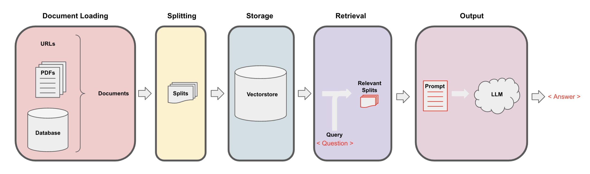

# Travel Assistant Bot

This project is designed to provide a conversational AI Travel Assistant Bot using LLM OpenAI's GPT model, leveraging a Chroma RAG for efficient retrieval. The bot can answer your questions based on what other people have written about the hotel. The web interface is implemented using Streamlit.

The overall workflow for retrieval augmented generation (RAG):



See the example in code in `hotel_Q&A_with_RAG.ipynb`.


## Setup

Create virtual environment:

```
python -m venv venv
```

Activate the virtual environment:
* On Windows:
```
venv\Scripts\activate
```
* On macOS and Linux:

```
source venv/bin/activate
```

Install dependencies:

```
pip install -r requirements.txt
```

Install new package if needed:

```
pip install {package_name}
pip freeze > requirements.txt
```

Deactivate the virtual environment:
```
deactivate
```

### Run

Add `OPENAI_API_KEY=` to `.env` file.

To run the travel assistant hotel Q&A chatbot:
```
streamlit run app.py
```

### Project Structure
The project is structured as follows:

* `ask_travel_assistant.py`: Contains the main logic for generating responses using OpenAI's language model and managing the vector database.
* `app.py`: Contains the Streamlit web application code.
* `data/`: Directory to store data files.
* `docs/chroma/`: Directory to store the vector database.
* `.env`: Environment variables file (not included in the repository, to be created by the user).
* `hotel_Q&A_with_RAG.ipynb`: Jupyter Notebook with step by step building of RAG

## Click to watch the Demo


https://github.com/anya-mb/hotel_Q-A/assets/47106377/68373b7c-0e0b-4d95-9628-08e2e30a92f2
